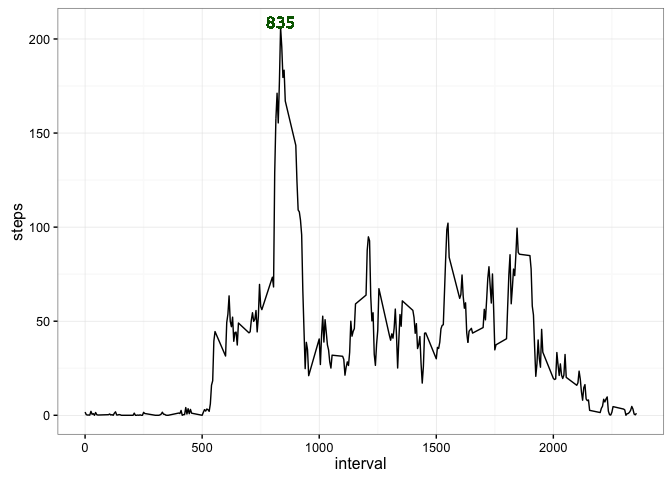

# Reproducible Research: Peer Assessment 1


********************


## Loading and preprocessing the data
********************
**1. Loading the data**


```r
fileLink <- "https://d396qusza40orc.cloudfront.net/repdata%2Fdata%2Factivity.zip"
temp <- tempfile()
download.file(fileLink, temp)
Act_data <- read.csv(unz(temp, "activity.csv"))
unlink(temp)
```


```r
Act_data <- transform(Act_data, date = as.Date(date))
```


## What is mean total number of steps taken per day?
********************
For this part of the assignment the missing values in the dataset can be ignored

**1. Make a histogram of the total number of steps taken each day**


```r
library(dplyr)
library(ggplot2)
```


```r
Act_dataSum <- aggregate(steps ~ date, Act_data, FUN = sum)
ggplot(Act_dataSum, aes(steps)) + theme_bw() + geom_histogram(col = "lightblue", fill = "darkblue", binwidth = 1000) 
```

<!-- -->

**2. Calculate and report the *mean* and *median* total number of steps taken per day**

```r
summary(Act_dataSum$steps) 
```

```
##    Min. 1st Qu.  Median    Mean 3rd Qu.    Max. 
##      41    8841   10760   10770   13290   21190
```

The mean total number of steps per day is <span style = "color:blue">10766.19</span> and the median total number of steps per day is <span style = "color:blue">10765</span>.


## What is the average daily activity pattern?
********************
1. Make a time series plot (i.e. type = "l") of the 5-minute interval (x-axis) and the average number of steps taken, averaged across all days (y-axis)


```r
Act_dataMean <- aggregate(steps ~ interval, Act_data, FUN = mean)
summary(Act_dataMean)
```

```
##     interval          steps        
##  Min.   :   0.0   Min.   :  0.000  
##  1st Qu.: 588.8   1st Qu.:  2.486  
##  Median :1177.5   Median : 34.113  
##  Mean   :1177.5   Mean   : 37.383  
##  3rd Qu.:1766.2   3rd Qu.: 52.835  
##  Max.   :2355.0   Max.   :206.170
```

```r
ggplot(Act_dataMean, aes(x = interval, y = steps)) + geom_line() + theme_bw() 
```

<!-- -->

2. Which 5-minute interval, on average across all the days in the dataset, contains the maximum number of steps?

```r
Act_dataMean %>%
        select(steps, interval) %>%
        filter(steps == max(steps))
```

```
##      steps interval
## 1 206.1698      835
```

```r
ggplot(Act_dataMean, aes(x = interval, y = steps)) + geom_line() + theme_bw() + geom_text(aes(835, 206.1698, label = 835), size = 4, vjust = 0, col = "darkgreen", family = "Verdana")
```

<!-- -->

The interval that contains the maximum number of steps corresponds to <span style = "color:darkgreen">835</span>.


## Imputing missing values
********************

There are a number of days/intervals where there are missing values(coded as NA). The presence of missing days may introduce bias into some calculations or summaries of data. 

1. Calculate and report the total number of missing values in the dataset (i.e the total number of rows with NAs)


```r
length(which(is.na(Act_data$steps) == T))
```

```
## [1] 2304
```
The total number of missing values in the dataset is <span style = "color:darkgreen">2304</span>.

2. Devise a strategy for filling in all of the missing values in the dataset. The strategy does not need to be sophisticated. For example, use the mean/median for that day, or the mean for that 5-minute interval.


```r
Act_data_sub <- Act_data[which(is.na(Act_data)),]
Act_data_complete <- Act_data[complete.cases(Act_data),]
Act_data_sub$steps <- replace(Act_data_sub$steps, Act_data_sub$interval %in% Act_dataMean$interval, Act_dataMean$steps)
```

3. Create a new dataset that is equal to the original dataset but with the missing data filled in. 


```r
TotalData <- bind_rows(Act_data_sub, Act_data_complete) 
TotalData <- TotalData %>%
                arrange(date) %>%
                glimpse()
```

```
## Observations: 17,568
## Variables: 3
## $ steps    (dbl) 1.7169811, 0.3396226, 0.1320755, 0.1509434, 0.0754717...
## $ date     (date) 2012-10-01, 2012-10-01, 2012-10-01, 2012-10-01, 2012...
## $ interval (int) 0, 5, 10, 15, 20, 25, 30, 35, 40, 45, 50, 55, 100, 10...
```

4. Make a histogram of the total number of steps taken each day and Calculate and report the **mean** and **median** total number of steps taken per day. Do these values differ from the estimates from the first part of the assignment? What is the impact of imputing missing data on the estimates of the total daily number of steps?


```r
TotalData_Sum <- aggregate(steps ~ date, TotalData, FUN = sum)
ggplot(TotalData_Sum, aes(steps)) + theme_bw() + geom_histogram(col = "lightblue", fill = "darkgreen", binwidth = 1000)
```

<!-- -->

Data with missing values imputation vs original data

```r
summary(Act_dataSum)
```

```
##       date                steps      
##  Min.   :2012-10-02   Min.   :   41  
##  1st Qu.:2012-10-16   1st Qu.: 8841  
##  Median :2012-10-29   Median :10765  
##  Mean   :2012-10-30   Mean   :10766  
##  3rd Qu.:2012-11-16   3rd Qu.:13294  
##  Max.   :2012-11-29   Max.   :21194
```

```r
summary(TotalData_Sum)
```

```
##       date                steps      
##  Min.   :2012-10-01   Min.   :   41  
##  1st Qu.:2012-10-16   1st Qu.: 9819  
##  Median :2012-10-31   Median :10766  
##  Mean   :2012-10-31   Mean   :10766  
##  3rd Qu.:2012-11-15   3rd Qu.:12811  
##  Max.   :2012-11-30   Max.   :21194
```

The mean and median values are similar to the original data, after imputing missing data, having no significant effect on the estimates of the total daily number of steps. 


## Are there differences in activity patterns between weekdays and weekends?
********************

Use the dataset with the filled-in missing values for this part.

1. Create a new factor variable in the dataset with two levels -- "weekday" and "weekend" indicating whether a given date is a weekday or weekend day.


```r
TotalData$Weekdays <- weekdays(TotalData$date)
Weekend <- TotalData$Weekdays[TotalData$Weekdays == c("Saturday", "Sunday")]
TotalData$Weekdays <- factor(TotalData$Weekdays %in% Weekend, levels = c(TRUE, FALSE), labels = c("weekend", "weekday"))
```

2. Make a panel plot containing a time series plot (i.e. type = "l") of the 5-minute interval (x-axis) and the average number of steps taken, averaged across all weekday days or weekend (y-axis).


```r
TotalDataMean <- aggregate(steps ~ interval + Weekdays, TotalData, FUN = mean)
summary(TotalDataMean)
```

```
##     interval         Weekdays       steps        
##  Min.   :   0.0   weekend:288   Min.   :  0.000  
##  1st Qu.: 588.8   weekday:288   1st Qu.:  2.047  
##  Median :1177.5                 Median : 28.133  
##  Mean   :1177.5                 Mean   : 38.988  
##  3rd Qu.:1766.2                 3rd Qu.: 61.263  
##  Max.   :2355.0                 Max.   :230.378
```

```r
ggplot(TotalDataMean, aes(x = interval, y = steps)) + geom_line() + theme_bw() + facet_grid(Weekdays ~.)
```

<!-- -->

